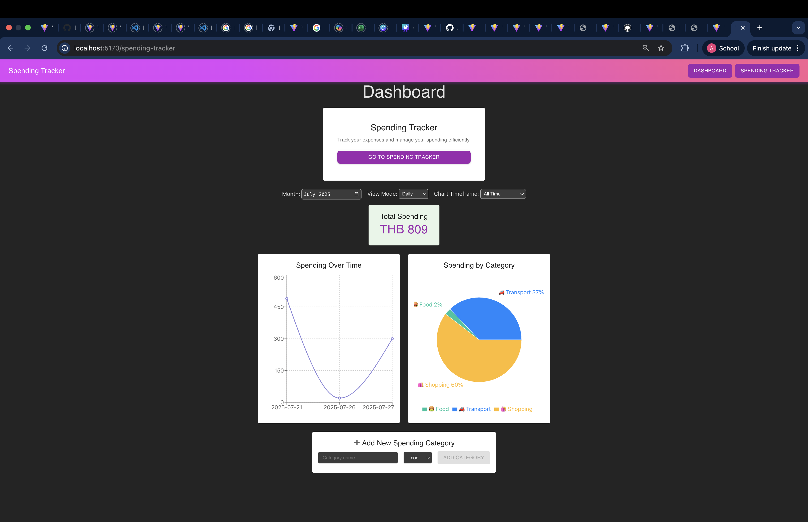
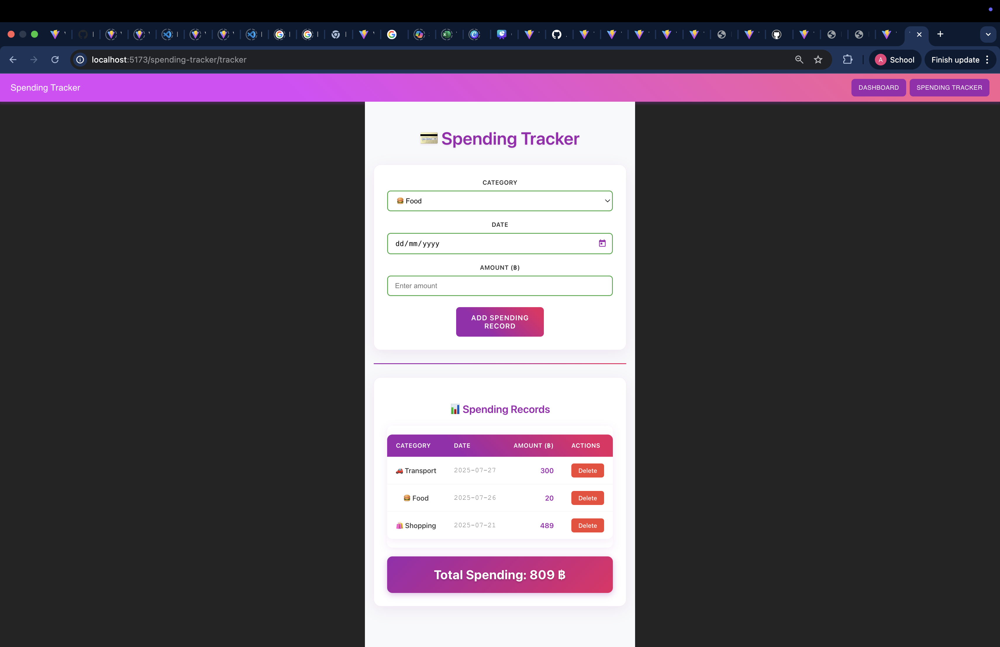

# Team Member
Thapana Dermbangchon  
Ayyada Kriangkaisak 

# 💰 Spending Tracker

A responsive web application for tracking personal expenses and managing spending . Built with React, Vite, and Material-UI with charts and analytics using recharts.

## ✨ Features

- **📊 Dashboard**: Interactive dashboard with spending analytics
- **💳 Expense Tracking**: Add, view, and delete spending records
- **📈 Data Visualization**: Line charts and pie charts for spending analysis
- **🏷️ Category Management**: Pre-defined and custom spending categories
- **📅 Time Filtering**: Filter expenses by month, view mode (daily/weekly/monthly)
- **💾 Local Storage**: Data persists locally in your browser
- **🎨 Modern UI**: Beautiful purple-themed design with Material-UI components
- **📱 Responsive**: Works on desktop and mobile devices

## 📸 Screenshots

### Dashboard Page

### Spending Tracker Page

## 🎯 Usage

### Page 1: Analytics Dashboard

The main dashboard provides  spending analytics with the following features:

#### Spending Summary Options
- **Daily View**: Shows spending broken down by individual days
- **Weekly View**: Groups spending by weeks for weekly analysis
- **Monthly View**: Displays spending aggregated by months

#### Total Spending Metrics
- **All Time Total**: Complete spending summary across all recorded periods
- **Selected Month Total**: Focused spending total for a specific chosen month

#### Interactive Charts
- **Line Chart**: Visual representation of spending trends over time
  - Available for both all-time and selected month periods
  - Shows spending patterns and trends clearly
- **Pie Chart**: Category-based spending breakdown
  - Displays spending distribution across different categories
  - Available for both all-time and selected month periods

#### Custom Category Management
- Add extra spending categories not included in the default list
- Save custom categories with emoji icons for easy identification
- Categories persist locally for future use

### Page 2: Spending Journal

The spending tracker page allows users to record and manage their expenses:

#### Record Entry Requirements
Users can add spending records by providing:
- **Date**: Date of the expense (no time required)
- **Spending Category**: Selected from the predefined or custom category list
- **Amount**: Summation of all value of the expense

## 🚀 Tech Stack

- **Frontend**: React 19, Vite 7
- **UI Library**: Material-UI (MUI) 7
- **Charts**: Recharts 3
- **Routing**: React Router DOM 7
- **Forms**: React Hook Form 7
- **State Management**: React Hooks + Local Storage
- **Styling**: CSS + Material-UI theming

